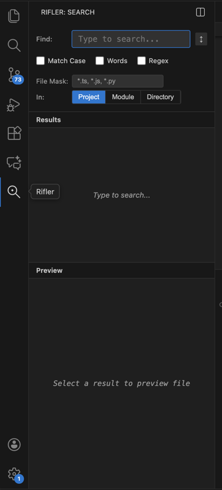

<div align="center">
  
  
  
  # Rifler

  Fast file search extension for VS Code. Rifle through your codebase with dynamic search, regex support, file masking, and full file preview with inline editing.
</div>

<div align="center">
  <strong>Tab Mode</strong>
  <br/>
  
</div>

<div align="center">
  <strong>Sidebar Mode</strong>
  <br/>
  
</div>

## Features

- **Dynamic Search** - Results appear as you type (no Find button needed)
- **High Performance**
  - **Virtualized Results** - Smooth scrolling with 10,000+ results
  - **Configurable Limit** - Adjust max results via `rifler.maxResults` setting
  - **Path Tooltips** - Hover truncated paths to see full file path
- **Multiple Scopes**
  - **Project** - Search entire workspace
  - **Module** - Search in detected modules (package.json, tsconfig.json, etc.)
  - **Directory** - Search in a specific directory (with editable path)
  - **File** - Search in a specific file (auto-enabled when file is opened from results)
- **Search Options**
  - **Match Case** - Case-sensitive search
  - **Words** - Match whole words only
  - **Regex** - Use regular expressions
  - **File Mask** - Filter by file patterns (e.g., `*.ts`, `*.js, *.py`)
    - Supports PyCharm-style include/exclude masks: comma/semicolon separated; `!` to exclude. Examples: `*.py`; `main.py, util.py`; `!*.txt`; `*.tsx,!*.test.tsx,!*.stories.tsx`; `*test*`.
- **Search & Replace**
  - **Replace One** - Replace current match and move to next
  - **Replace All** - Replace all occurrences in search results
  - **Undo Support** - Full undo support for all replacements
- **Full File Preview**
  - View entire file with all matches highlighted
  - **Syntax Highlighting** - Code highlighting for 50+ languages (powered by highlight.js)
  - **Click to Edit** - Click anywhere in preview to start editing inline
  - **Auto-save** - Changes auto-save as you type
- **Responsive Sidebar**
  - Layout flexes to the default VS Code sidebar width with wrapping controls (no overflow on first open)
  - Restores your last search, results, and preview when reopening
- **Inline File Editing**
  - Edit files directly in the preview panel
  - Real-time syntax highlighting while editing
  - Integrated search & replace within the file
  - Line numbers with synchronized scrolling
- **Keyboard Navigation**
  - `↑/↓` - Navigate results
  - `Enter` - Open selected result in editor
  - `Double-click` - Open file at clicked line
  - `Cmd+Alt+R` (Mac) / `Ctrl+Alt+R` (Windows/Linux) - Open Replace mode
  - `Alt+R` - Open Replace in File widget
  - `Cmd+S` / `Ctrl+S` - Save current file (in edit mode)
  - `Escape` - Exit edit mode or focus search box

## Usage

### Opening Rifler

Press `Cmd+Alt+F` (Mac) or `Ctrl+Alt+F` (Windows/Linux) to **toggle** Rifler open/close.

- By default, Rifler opens in the **sidebar** (Activity Bar)
- To use **tab mode** instead, change the setting: `rifler.viewMode` to `"tab"`
- The same shortcut toggles open/close in both modes

### Searching

1. Open Rifler with `Cmd+Alt+F` (Mac) or `Ctrl+Alt+F` (Windows/Linux)
2. Type your search query (results appear dynamically after 2+ characters)
3. Toggle search options as needed (Match Case, Words, Regex)
4. Use File Mask to filter results (e.g., `*.ts, *.js`)
5. Select scope (Project/Module/Directory)
6. Navigate results with arrow keys and preview files
7. Click on preview to edit inline, or double-click to open in main editor

### Replace in Search Results
1. Press `Cmd+Alt+R` (Mac) or `Ctrl+Alt+R` (Windows/Linux) to open replace mode
2. Enter replacement text
3. Press `Enter` to replace current match, or `Cmd+Enter` / `Ctrl+Enter` to replace all

### Inline Editing
Click anywhere in the file preview to enter edit mode:
- Edit directly with full syntax highlighting
- Changes auto-save after 1 second of inactivity
- Press `Escape` to exit edit mode
- Press `Cmd+S` / `Ctrl+S` to save immediately

### Choosing Your View Mode

Rifler can open in two modes:

1. **Sidebar Mode (Default)** - Opens in the Activity Bar sidebar
   - Use `Cmd+Alt+F` (Mac) / `Ctrl+Alt+F` to toggle open/close
   - Or click the Rifler icon in the Activity Bar

2. **Tab Mode** - Opens as a separate editor tab
   - Change setting: `rifler.viewMode` to `"tab"`
   - Use `Cmd+Alt+F` (Mac) / `Ctrl+Alt+F` to toggle open/close

<div align="center">
  
</div>

### Switching Between Modes

You can switch between sidebar and tab mode:
- Use `Cmd+Alt+T` (Mac) / `Ctrl+Alt+T` (Windows/Linux)
- Or use the toggle button in the sidebar view title

### Replace in Preview Editor
While editing a file in the preview panel:
1. Press `Alt+R` or the configured keybinding (default: `Ctrl+Shift+R`) to open the replace widget
2. Use `↑/↓` arrows or `Enter/Shift+Enter` to navigate between matches
3. Press `Enter` to replace current match, or `Cmd+Enter` / `Ctrl+Enter` to replace all
4. Press `Escape` or `✕` to close the replace widget

## Customizing Keybindings

### Replace in Preview Keybinding
The keybinding to open the replace widget while editing in the preview can be customized via VS Code settings:

1. Open Settings (`Cmd+,` on Mac / `Ctrl+,` on Windows/Linux)
2. Search for "rifler"
3. Change **Rifler: Replace In Preview Keybinding** to your preferred keybinding

Or add to your `settings.json`:
```json
{
  "rifler.replaceInPreviewKeybinding": "ctrl+shift+r"
}
```

**Format:** `modifier+key` (e.g., `ctrl+shift+r`, `cmd+r`, `alt+h`, `ctrl+h`)

### Global Keybindings
To customize the main Rifler keybindings, open Keyboard Shortcuts (`Cmd+K Cmd+S`) and search for "rifler":

| Command | Default (Mac) | Default (Windows/Linux) |
|---------|---------------|------------------------|
| Rifler: Toggle Open/Close | `Cmd+Alt+F` | `Ctrl+Alt+F` |
| Rifler: Open Replace Mode | `Cmd+Alt+R` | `Ctrl+Alt+R` |
| Rifler: Switch View Mode | `Cmd+Alt+T` | `Ctrl+Alt+T` |

### View Mode Configuration

To change the default view mode, add to your `settings.json`:

```json
{
  "rifler.viewMode": "sidebar"  // or "tab"
}
```

Or change it in Settings UI:
1. Open Settings (`Cmd+,` on Mac / `Ctrl+,` on Windows/Linux)
2. Search for "rifler viewMode"
3. Choose either "sidebar" or "tab"

### Max Results Configuration

To change the maximum number of search results, add to your `settings.json`:

```json
{
  "rifler.maxResults": 10000  // default, minimum: 100
}
```

With virtualized rendering, Rifler efficiently handles large result sets without UI lag.

## Installation

### From VSIX
1. Download the `.vsix` file
2. Open VS Code
3. Press `Cmd+Shift+P` → "Extensions: Install from VSIX..."
4. Select the downloaded file

### From Marketplace
Search for "Rifler" in the VS Code Extensions marketplace.

## Performance

Benchmark results on a large production codebase (~100k+ files):

| Scenario | Matches | Time |
|----------|---------|------|
| Search for "function" keyword | 5000+ | ~1.7s |
| Search for import statements (regex) | 5000+ | ~1.5s |
| Search for "if" keyword | 5000+ | ~0.4s |
| Search for variable declarations (regex) | 5000+ | ~1.3s |

**Average search time: ~1.2s** on large codebases | Max results: **10,000** (configurable)

On smaller codebases (< 10k files), search times are typically **under 100ms**.

**Optimizations:**
- 🎯 Smart exclusions (node_modules, .git, binaries, hidden folders)
- 🚀 Early termination at configurable max results (default: 10,000)
- 💾 Memory efficient (skips files > 1MB)
- ⚡ Parallel async I/O with concurrency limiter
- 🖥️ Virtualized results list for smooth scrolling with large result sets

*Run `node benchmark.js [path]` to test performance on your own codebase*

## Testing

### Unit Tests
Run the unit test suite:
```bash
npm test
```

### Coverage Report
Generate test coverage:
```bash
npm run test:coverage
```

### End-to-End Tests
Run automated E2E tests that simulate user interactions using the official VS Code testing CLI:
```bash
npm run test:e2e
```

**Watch E2E tests live** (like Selenium browser testing):
```bash
npm run test:e2e:visible
```
This opens VS Code windows where you can see the tests running in real-time, perfect for debugging and understanding test behavior.

**Debug E2E tests** with inspector:
```bash
npm run test:e2e:debug
```

**Analyze E2E test coverage** (feature coverage analysis):
```bash
npm run test:e2e:coverage
```

**Run combined coverage** (unit tests + E2E tests):
```bash
npm run test:combined-coverage
```

The E2E tests automatically:
- Download and launch the specified version of VS Code
- Load your extension in development mode
- Test command registration and execution
- Verify webview panel creation
- Test configuration handling
- Validate search and replace functionality
- Run on Windows, macOS, and Linux via GitHub Actions

Tests are configured using `.vscode-test.js` for maximum flexibility and CI/CD compatibility.

### CI/CD Automation
Tests run automatically on:
- Every push to main/develop branches
- All pull requests
- Multiple operating systems (Windows, macOS, Linux)

View test results and coverage in the Actions tab.

## Requirements

- VS Code 1.85.0 or higher

## License

MIT
